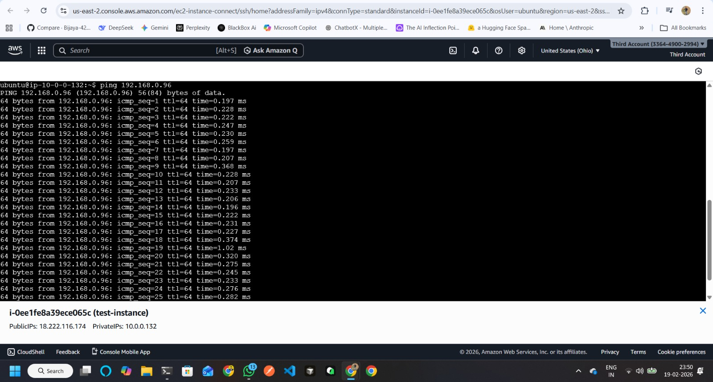
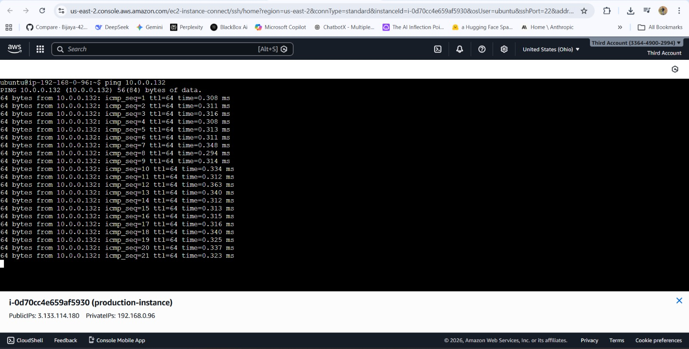

# 🔗 VPC Peering: Test ↔ Prod Environment

## 📌 Project Overview

This project demonstrates a VPC Peering connection between two separate AWS VPCs:

- 🟢 Test VPC
- 🔵 Production VPC

The goal is to enable private communication between EC2 instances in both VPCs without using the internet.

---

## 🏗 Architecture

- Two VPCs created in the same AWS Region
- Non-overlapping CIDR blocks
- VPC Peering connection established
- Route tables updated in both VPCs
- Security Groups configured to allow internal traffic

---

## 🌐 Network Configuration

### 🟢 Test VPC
- CIDR: `10.0.0.0/16`
- Private Subnet
- EC2 instance deployed

### 🔵 Prod VPC
- CIDR: `192.168.0.0/16`
- Private Subnet
- EC2 instance deployed

---

## 🔁 VPC Peering Steps

1. Created VPC Peering connection
2. Accepted peering request
3. Updated route table in Test VPC:
   - Destination: `192.168.0.0/16`
   - Target: VPC Peering Connection

4. Updated route table in Prod VPC:
   - Destination: `10.0.0.0/16`
   - Target: VPC Peering Connection

5. Updated Security Groups to allow internal communication

---

## ✅ Verification

- Successfully pinged EC2 instances across VPCs
- Confirmed private IP connectivity
- Verified no internet gateway was used

---

## 🧠 Key Learning

- Understanding CIDR planning
- Route table configuration
- Cross-VPC private communication
- Network isolation and architecture design

---

## 📸 Architecture Screenshots

### Test VPC

### Prod VPC

---

## 🚀 Conclusion

This hands-on implementation strengthened my understanding of AWS networking, VPC routing, and secure environment segmentation between Test and Production workloads.

---

#DevOps #AWS #VPC #CloudNetworking
